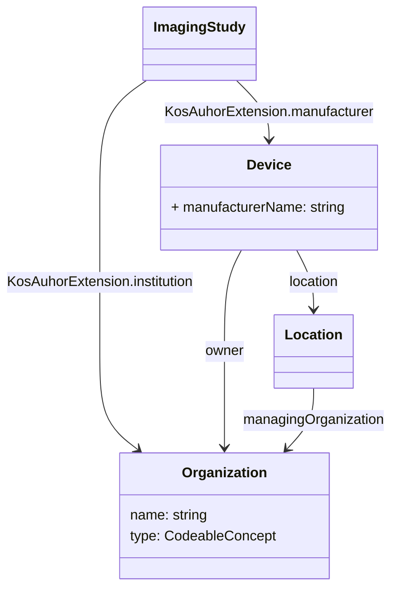

# Observations

## KOS manufacturer

This is stored in the general equipment module in KOS. Where to store in FHIR?

### Add KOS manufacturer serie

One option is to add a series to the ImagingStudy for the KOS. That would match
the FHIR model but other options may be possible. It would also be difficult to 
distinguish this series from other KOS series.

Another option is use Bundle.link to point to the resources. The main option
is the link[author] which points to html. We could include a special url 
that points to the KOS manufacturer information in the bundle. Not nice.
There is language about links pointing to resources in https://build.fhir.org/documents.html#css, 
where a link to a stylesheet is given as a relative refernce to a Binary resource
in the Bundle. The link[stylesheet] is also of type html.

### Use Bundle.link

This would allow the link but placing it at the Bundle and not in the resources 
makes that the information is removed when the resource is stored as local
resources. Therefore this option is not preferred.

### Extension on ImagingStudy

Another option is to store it as an extension on the ImagingStudy. This would 
make it easier to find the KOS information. As this is info specific to the manifest
this option is preferred. 

The next question is in what way to best represent the KOS manufacturer information.
The KOS manufacturer information includes the following fields:

* Manufacturer - name of the manufacturer of the KOS manifest software
* Institution Name - name of the institution that created the KOS manifest
* Institution Code Sequence - coded equivalent of the Institution Name

Manufacturer relates in FHIR to `Device.manufacturer` and Institution Name to 
`Organization.name` and `Organization.type`.

Device can be linked to an Organization as owner and to a Location as place of use.

Inclusion of all three resources is a bit heavy and might be overkill.
When the manifest is also included as a series, it would be good as the point
to the same resources. 

### Provenance

Another option, which is also suggested from [`Resource.meta.source`](https://build.fhir.org/resource-definitions.html#Meta.source) 
is to use Provenance to store the KOS manufacturer information. 
Provenance is a resource that describes the origin of other resources. Which maps on this use case.

